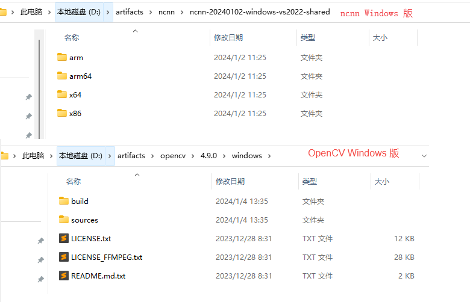

# squeezenet-ncnn-pnnx-opencv-cpp

## 简介

使用 pnnx 工具， 转换 PyTorch 模型到 ncnn 格式。然后用 opencv 读取图像， 用 ncnn 做推理， 执行图像分类，输出类别和置信度。

你可以基于这个工程， 直接(或者很少修改)放到 Android JNI / 车载开发板上部署。

## 安装 - Python 相关

安装 Python, 例如通过 miniconda 安装。

安装 torch, pnnx 等 python 包:

```bash
pip install numpy matplotlib
pip install -U torch torchvision
pip install -U pnnx
```

## 安装 - C++ 相关



下载 ncnn: https://github.com/Tencent/ncnn/releases

D:\artifacts\ncnn\ncnn-20240102-windows-vs2022

下载 opencv: https://github.com/opencv/opencv/releases/

## 转模型

```powershell
python export_resnet18.py
```

得到很多文件，我们只用到 `resnet18.ncnn.param` 和 `resnet18.ncnn.bin`.

## C++ 推理

- `detect_squeezenet_pnnx()`: PyTorch 官方仓库中 squeezenet1_1 的推理
- `detect_squeezenet_caffe()`: ncnn 仓库自带的的模型的推理，也就是 caffemodel

两个模型的输入、输出处理差异，见 `detect_squeezenet_pnnx()` 函数。

## Debug

VS 调试 C++ 代码，需要另行配置 Debug 版本的 ncnn, 需要自行编译。

## Referenecs

- https://github.com/Tencent/ncnn
- https://github.com/opencv/opencv
